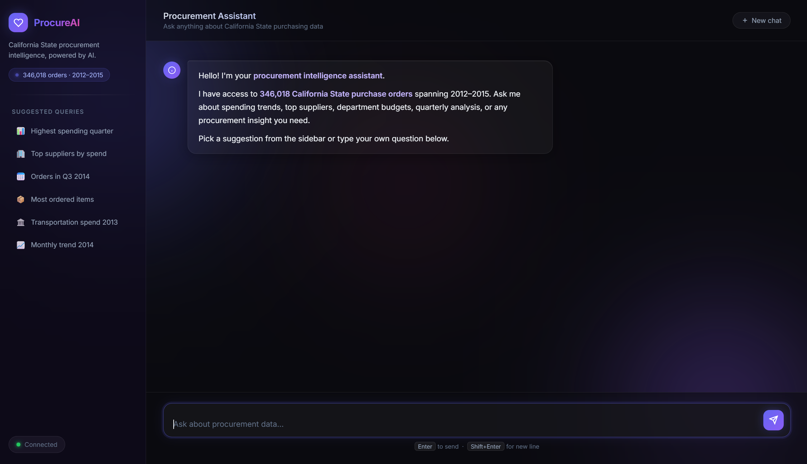

# ProcureAI — California State Procurement Intelligence

An AI-powered chat assistant for exploring 346,018 California State purchase orders (2012–2015), built with FastAPI, LangGraph, MongoDB, and Chart.js.



---

## Features

- **Natural language queries** — ask anything about spending, suppliers, departments, or time periods
- **Interactive charts** — automatic bar, line, and pie chart generation via Chart.js
- **Anomaly detection** — flags unusual spending patterns in query results
- **Smart suggestions** — follow-up query suggestions after each answer
- **Session memory** — maintains conversation context across multiple questions
- **Query caching** — repeated questions return instantly
- **Streaming responses** — answers stream token by token via Server-Sent Events
- **CSV export** — download any result table as a CSV file

---

## Tech Stack

| Layer | Technology |
|---|---|
| Backend | FastAPI + Uvicorn |
| AI Agent | LangGraph (ReAct) + OpenAI GPT |
| Database | MongoDB |
| Frontend | Vanilla JS + Chart.js |
| Data | California State Procurement 2012–2015 |

---

## Setup

### Prerequisites

- Python 3.11+
- MongoDB running locally on port 27017
- OpenAI API key

### 1. Clone the repo

```bash
git clone https://github.com/mrym-git/procurement-assistant.git
cd procurement-assistant
```

### 2. Create a virtual environment

```bash
python -m venv .venv
.venv\Scripts\activate      # Windows
# source .venv/bin/activate # macOS/Linux
```

### 3. Install dependencies

```bash
pip install -r requirements.txt
pip install -r backend/requirements.txt
```

### 4. Configure environment variables

Create a `.env` file in the project root:

```env
OPENAI_API_KEY=your-openai-api-key-here
MONGODB_URI=mongodb://localhost:27017/
```

### 5. Load the data into MongoDB

Download the dataset from Kaggle:
[California State Procurement Data](https://www.kaggle.com/datasets/samuelcortinhas/california-state-procurement-data)

Place the CSV in the project root, then run the notebook to clean and load the data:

```bash
jupyter notebook explore_data.ipynb
```

### 6. Start the server

```bash
cd backend
uvicorn main:app --reload --port 8000
```

Open your browser at **http://localhost:8000**

---

## Example Queries

- How many orders were placed in Q3 2014?
- Which quarter had the highest spending?
- Top 5 suppliers by total spend
- Department of Transportation spend in 2013
- Orders above $50,000

---

## Project Structure

```
procurement-assistant/
├── backend/
│   ├── main.py               # FastAPI app & routes
│   ├── agent.py              # LangGraph ReAct agent
│   ├── anomaly_detector.py   # Spending anomaly detection
│   ├── chart_builder.py      # Chart.js spec builder
│   ├── query_cache.py        # In-memory query cache
│   ├── query_validator.py    # Confidence scoring
│   ├── session_memory.py     # Conversation memory
│   └── suggestion_generator.py
├── frontend/
│   ├── index.html
│   ├── style.css
│   └── app.js
├── images/
│   └── image.png
├── explore_data.ipynb        # EDA & MongoDB data loader
└── requirements.txt
```

---

## API Endpoints

| Method | Endpoint | Description |
|---|---|---|
| `GET` | `/` | Serves the chat UI |
| `GET` | `/api/health` | Health check (API + MongoDB status) |
| `GET` | `/api/session/new` | Generate a new session ID |
| `POST` | `/api/stream` | Streaming chat (SSE) |
